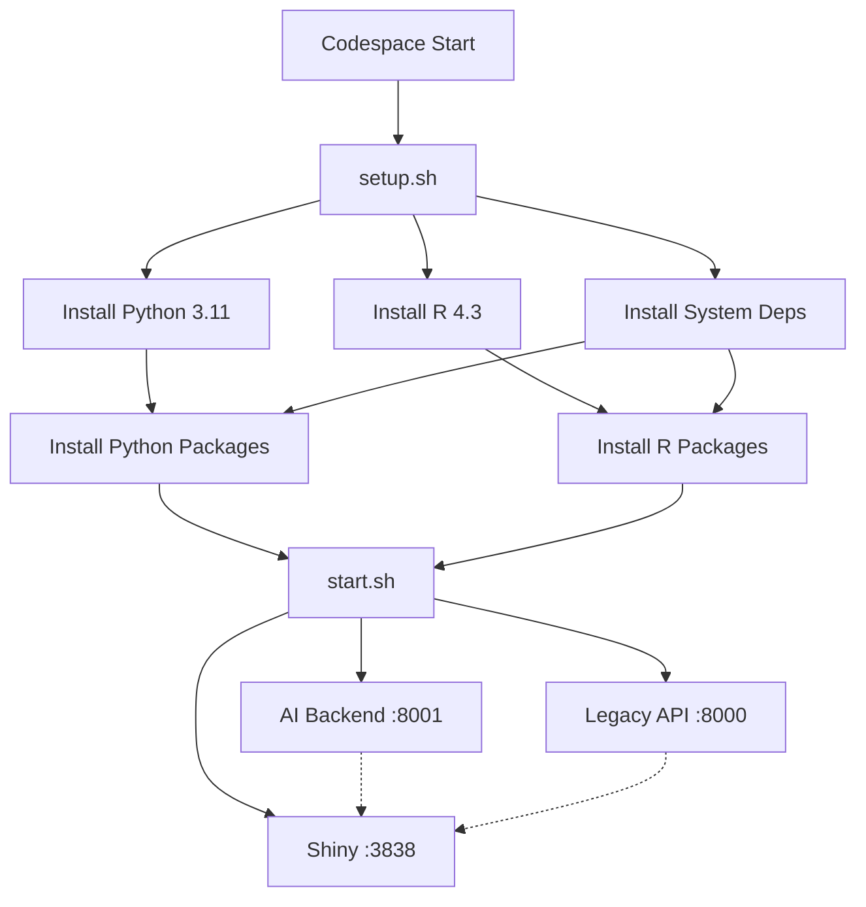

# Codespaces Configuration Review

## ✅ What's Been Added

Your project is now configured for **instant startup in GitHub Codespaces**! Here's what was added:

### 1. DevContainer Configuration
**File**: `.devcontainer/devcontainer.json`

- Configures Ubuntu-based container with Python 3.11 and R 4.3
- Includes Docker-in-Docker for running docker-compose if needed
- Automatically forwards ports 3838 (Shiny), 8000 (Legacy API), 8001 (AI Copilot)
- Installs VS Code extensions for Python, R, and Docker
- Runs setup script on container creation
- Runs start script every time container starts

### 2. Automated Setup Script
**File**: `.devcontainer/setup.sh`

This script runs **once** when the Codespace is first created:
- ✅ Installs system dependencies (libcurl, libssl, libxml2, pandoc, etc.)
- ✅ Installs Python packages from `backend/requirements.txt`
- ✅ Installs Python packages from `backend/api/requirements.txt`
- ✅ Installs all R packages (shiny, metafor, netmeta, BCEA, etc.)
- ✅ Creates output directories with proper permissions
- ⏱️ Takes ~5-10 minutes on first run

### 3. Service Startup Script
**File**: `.devcontainer/start.sh`

This script runs **every time** the Codespace starts:
- 🧹 Cleans up any existing processes on ports 3838, 8000, 8001
- 🤖 Starts AI Copilot Backend (FastAPI) on port 8001
- 🐍 Starts Legacy Backend (FastAPI) on port 8000
- 📊 Starts Shiny Frontend on port 3838
- 📝 Logs all output to `outputs/*.log` files
- ⏱️ Takes ~10 seconds to start all services

### 4. Documentation
- **CODESPACES_SETUP.md**: Comprehensive guide for users
- **CODESPACES_REVIEW.md**: This file - technical review for developers
- **start-dev.sh**: Quick-start script for local development

### 5. Git Configuration
- **.gitattributes**: Ensures shell scripts use LF line endings (prevents issues on Windows)

---

## 🎯 How It Works

### First-Time Codespace Creation

1. User clicks "Code" → "Codespaces" → "Create codespace"
2. GitHub creates Ubuntu container
3. DevContainer installs Python 3.11, R 4.3, Docker
4. `setup.sh` runs automatically:
   - Installs system dependencies (~2 min)
   - Installs Python packages (~1 min)
   - Installs R packages (~5-10 min)
   - Creates directories
5. `start.sh` runs automatically:
   - Starts all 3 services (~10 sec)
6. User gets notification: "Your application is running on port 3838"
7. User clicks notification → Opens Shiny app in browser

**Total time: ~8-12 minutes** (only on first creation)

### Subsequent Starts

1. User opens existing Codespace
2. Container starts in ~30 seconds
3. `start.sh` runs automatically (~10 sec)
4. All services ready to use

**Total time: ~40 seconds**

---

## 📋 Testing Checklist

Before merging, please test the following:

### Local Testing (Optional)
```bash
# 1. Install dependencies locally
bash .devcontainer/setup.sh

# 2. Start services
bash .devcontainer/start.sh

# 3. Verify services are running
curl http://localhost:8001/health
curl http://localhost:8000/health
curl http://localhost:3838

# 4. Check logs
tail -f outputs/ai-backend.log
tail -f outputs/backend.log
tail -f outputs/shiny.log
```

### Codespaces Testing (Recommended)

1. ✅ Create new Codespace from this branch
2. ✅ Wait for automatic setup to complete (~10 min)
3. ✅ Verify all 3 port notifications appear
4. ✅ Click "Open in Browser" for port 3838
5. ✅ Verify Shiny app loads correctly
6. ✅ Open http://localhost:8001/docs in new tab
7. ✅ Verify AI Copilot API docs load
8. ✅ Open http://localhost:8000/docs in new tab
9. ✅ Verify Legacy API docs load
10. ✅ Test a basic workflow:
    - Upload sample data file
    - Run meta-analysis
    - Generate report
11. ✅ Stop and restart Codespace
12. ✅ Verify services auto-start on restart

---

## 🔍 Architecture Review

### Service Dependencies



### Directory Structure

```
Metanew/
├── .devcontainer/
│   ├── devcontainer.json    # Main configuration
│   ├── setup.sh            # Dependency installation
│   └── start.sh            # Service startup
├── .gitattributes          # Line ending config
├── backend/
│   ├── requirements.txt    # Python deps (general)
│   └── api/
│       ├── requirements.txt   # Python deps (API-specific)
│       ├── main.py           # Legacy API (:8000)
│       └── nlq.py            # AI Copilot (:8001)
├── frontend/
│   ├── app.R               # Shiny app entry point
│   ├── modules/            # Shiny modules
│   └── utils/              # Utility functions
├── outputs/                # Logs and generated files
│   ├── ai-backend.log
│   ├── backend.log
│   └── shiny.log
├── data/                   # Sample data files
├── CODESPACES_SETUP.md     # User guide
├── CODESPACES_REVIEW.md    # This file
├── start-dev.sh            # Local dev quick-start
└── docker-compose.yml      # Alternative: Docker Compose
```

---

## ⚙️ Configuration Details

### Python Environment
- **Version**: 3.11
- **Packages**: FastAPI, uvicorn, pandas, numpy, pydantic, pytest
- **Location**: `/usr/local/bin/python`

### R Environment
- **Version**: 4.3
- **Packages**: shiny, bslib, metafor, netmeta, dosresmeta, BCEA, DT, plotly
- **Location**: `/usr/bin/R`

### System Dependencies
- libcurl4-openssl-dev
- libssl-dev
- libxml2-dev
- libfontconfig1-dev, libharfbuzz-dev, libfribidi-dev (for text rendering)
- libfreetype6-dev, libpng-dev, libtiff5-dev, libjpeg-dev (for graphics)
- pandoc (for R Markdown reports)

### Ports
| Port | Service | Auto-Forward | Purpose |
|------|---------|--------------|---------|
| 3838 | Shiny | ✅ Notify | Main web UI |
| 8001 | AI Copilot | ✅ Notify | Natural language API |
| 8000 | Legacy API | Silent | Data validation API |

---

## 🚨 Known Issues & Solutions

### Issue 1: R Package Installation Timeout
**Symptom**: Setup script times out during R package installation

**Solution**: R packages can take 5-10 minutes. If timeout occurs:
```bash
# Manually install packages in chunks
Rscript -e "install.packages(c('shiny', 'bslib', 'DT'), repos='https://cloud.r-project.org/')"
Rscript -e "install.packages(c('metafor', 'netmeta', 'dosresmeta'), repos='https://cloud.r-project.org/')"
```

### Issue 2: Port Already in Use
**Symptom**: "Port 3838 is already in use"

**Solution**: Kill existing processes and restart
```bash
pkill -f uvicorn && pkill -f shiny
bash .devcontainer/start.sh
```

### Issue 3: Shiny App Not Loading
**Symptom**: 404 error when accessing http://localhost:3838

**Solution**: Check Shiny log for errors
```bash
tail -f outputs/shiny.log
# Common issue: missing R packages
Rscript -e "install.packages('missing_package')"
```

### Issue 4: API Returns 500 Errors
**Symptom**: API endpoints return internal server errors

**Solution**: Check backend logs
```bash
tail -f outputs/ai-backend.log
tail -f outputs/backend.log
# Common issue: missing Python packages
pip install -r backend/api/requirements.txt
```

---

## 🎯 Performance Optimizations

### Current Setup
- R packages installed with `Ncpus = 4` (parallel compilation)
- Python packages cached in container
- Services run in background with nohup
- Logs redirected to files (not cluttering terminal)

### Possible Improvements
1. **Pre-build Docker image**: Push custom image to avoid rebuilding R packages
2. **Cache R packages**: Use persistent volume for R library
3. **Lazy loading**: Only install packages when first needed
4. **Smaller base image**: Use slim images to reduce startup time

---

## 📝 Maintenance

### Updating Dependencies

**Python packages:**
```bash
# Update requirements.txt
vim backend/requirements.txt
vim backend/api/requirements.txt

# Reinstall
pip install -r backend/requirements.txt --upgrade
```

**R packages:**
```bash
# Update in setup.sh
vim .devcontainer/setup.sh

# Or install manually
Rscript -e "install.packages('new_package')"
```

### Adding New Services

1. Update `devcontainer.json` to forward new port
2. Add startup command to `start.sh`
3. Document in `CODESPACES_SETUP.md`

---

## ✅ Success Criteria

Your Codespace setup is successful if:

1. ✅ New Codespace starts without errors
2. ✅ All 3 services start automatically
3. ✅ Shiny app loads at http://localhost:3838
4. ✅ API docs load at http://localhost:8001/docs and :8000/docs
5. ✅ Sample workflow completes successfully:
   - Upload `data/sample_binary.csv`
   - Run pairwise meta-analysis
   - View forest plot
   - Generate Word report
6. ✅ Services auto-restart when Codespace restarts
7. ✅ No permission errors in logs
8. ✅ All tests pass (Python and R)

---

## 🎓 Learning Resources

### Codespaces Documentation
- [GitHub Codespaces Docs](https://docs.github.com/en/codespaces)
- [DevContainer Specification](https://containers.dev/)
- [DevContainer Features](https://containers.dev/features)

### Project-Specific Docs
- [README.md](README.md) - Project overview
- [QUICKSTART.md](QUICKSTART.md) - 5-minute quick start
- [DEPLOYMENT_GUIDE.md](DEPLOYMENT_GUIDE.md) - Production deployment

---

## 🤝 Contributing

If you make improvements to the Codespaces setup:

1. Test thoroughly in a fresh Codespace
2. Update `CODESPACES_SETUP.md` with user-facing changes
3. Update this file (`CODESPACES_REVIEW.md`) with technical details
4. Document any new dependencies in setup.sh
5. Update success criteria if needed

---

**Last Updated**: 2025-11-16
**Status**: ✅ Ready for Testing
**Next Step**: Create new Codespace and verify all services start correctly
